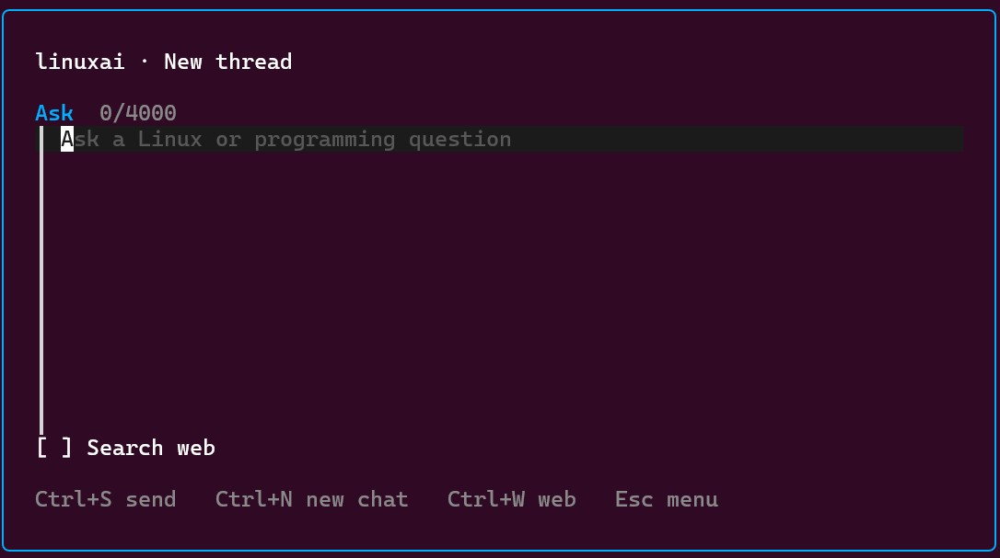
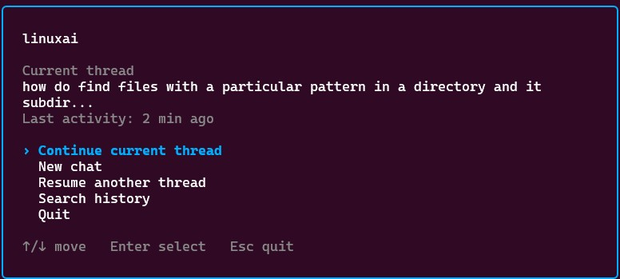

# linuxai

A terminal-first CLI assistant for Linux and Linux-programming questions.
Ask it something, get a streamed answer in your terminal.

- **One static binary.** No runtime, no shared libraries, no interpreter.
  `scp` it to any Linux box and run it.
- **Works over SSH.** Nothing assumes a desktop, a clipboard, or a GUI.
- **Streams as it goes,** rendering Markdown live as ANSI when stdout is a
  terminal and falling back to raw Markdown when piped.
- **Remembers the conversation** in local JSONL threads you can list, resume,
  and search.
- **Optional guarded web access** through your own SearXNG instance, with
  per-origin consent before reading anything outside a reviewed docs whitelist.
- **Bring your own backend.** Any OpenAI-compatible endpoint: NVIDIA's hosted
  free tier by default, local Ollama with one variable change.

<p align="center">
  
</p>
<p align="center"><em>New-thread prompt with the optional web-search toggle.</em></p>

<p align="center">
  
</p>
<p align="center"><em>Active-thread menu with continue, new chat, resume, and history search actions.</em></p>

## Quick start

```bash
# 1. Install (see "Installation" for how to get the .run file)
chmod +x ./linuxai-installer-<version>.run
./linuxai-installer-<version>.run

# 2. Add your API key
nano ~/.config/linuxai/.env          # or your preferred editor; set NVIDIA_API_KEY=...

# 3. Ask something
linuxai how do I list hidden files in bash
```

If the `linuxai` command isn't found afterwards, add `~/.local/bin` to your
`PATH`.

## Installation

### From a release installer

Download `linuxai-installer-<version>.run` from the
[releases page](https://github.com/rodneyviana/linuxai/releases), copy it to
the target machine, and run it:

```bash
chmod +x linuxai-installer-<version>.run
./linuxai-installer-<version>.run
```

No sudo needed. The installer detects the machine's architecture
(`uname -m`) and then:

- installs the matching binary to `~/.local/bin/linuxai` and prints the
  version it installed (warning if `~/.local/bin` isn't on your `PATH`)
- creates `~/.config/linuxai/.env` from the template, never overwriting an
  existing one
- reminds you to fill in `NVIDIA_API_KEY` before first use

[`scripts/install.sh`](scripts/install.sh) is what the installer runs after
extraction, if you'd rather read or adapt it directly.

### From source

```bash
# Workstation / server (x86-64)
CGO_ENABLED=0 GOOS=linux GOARCH=amd64 go build -o linuxai-amd64 ./cmd/linuxai

# Jetson Orin (arm64)
CGO_ENABLED=0 GOOS=linux GOARCH=arm64 go build -o linuxai-arm64 ./cmd/linuxai
```

Copy the resulting binary somewhere on your `PATH`, for example
`~/.local/bin/linuxai`.

## Configuration

All configuration comes from environment variables. linuxai looks for `./.env`
first, then `~/.config/linuxai/.env`; values already set in the process
environment always win.

```bash
cp .env.example .env      # or edit ~/.config/linuxai/.env
```

| Variable | Purpose |
|---|---|
| `NVIDIA_API_KEY` | API key for the NVIDIA hosted free endpoint. Required unless you point at Ollama. |
| `LINUXAI_BASE_URL` | Backend base URL. Defaults to the NVIDIA endpoint; set `http://localhost:11434/v1` to use local Ollama instead. |
| `LINUXAI_MODEL` | Model string to use. Defaults to `openai/gpt-oss-20b`. |
| `LINUXAI_SEARXNG_URL` | SearXNG instance used by the `web_search` tool. Required to enable `-w`/`--web`; the launcher hides its web toggle when unset. Must point at the published port, and the instance needs `json` under `search.formats` in `settings.yml`. |

### Custom instructions

The user config directory is `${XDG_CONFIG_HOME:-~/.config}/linuxai`. Put
custom assistant instructions in `instructions.txt` there, next to the user
`.env`:

```text
~/.config/linuxai/instructions.txt
```

If that file is missing or blank, linuxai uses this built-in instruction:

```text
Only answer questions about operating systems, especially Linux if no OS is specified, and programming. Do not be verbose unless required. If a question is outside this scope, do not apologize or give only a generic refusal. Briefly explain that you can help with operating systems, Linux, command-line tools, system administration, software development, debugging, and programming, give one or two relevant examples, and suggest a computing-related way to reframe the question when natural.
```

## Usage

Pass the question as plain trailing arguments, no quoting needed:

```bash
linuxai how do I list hidden files in bash
```

or pipe it on stdin:

```bash
echo "what does chmod 755 mean?" | linuxai
```

The answer streams to stdout token by token as it's generated.

### Interactive launcher

Run `linuxai` with no prompt in a terminal to open the launcher. An active
thread opens a menu with Continue selected; a missing, empty, or five-minute-idle
thread opens the prompt directly. From there you can start a new chat, resume or
search history, and toggle web search. The launcher closes before the answer
streams, so the response stays normal selectable terminal output.

Prompt keys: `Ctrl+S` to send, `Ctrl+N` for a new chat, `Ctrl+W` to toggle web
search, and `Esc` to return to the menu. Argument prompts and piped input never
open the launcher.

### Flags

Flags can appear anywhere in the command; every other token is joined back
together, in order, as the prompt.

| Flags | Effect |
|---|---|
| `-n`, `--new`, `--new-thread` | Start a fresh thread instead of applying the idle-time rule. |
| `-r`, `--resume <id>` | Switch the active thread to `<id>` (see `--list`), then continue it with the given prompt. |
| `-l`, `--list` | Print saved threads (id, last-modified time, title = first message). No LLM call. |
| `-s`, `--search <term>` | Grep every saved thread for `<term>` and print matches. No LLM call. |
| `-w`, `--web` | Enable model-driven `web_search` and guarded `web_read`. Equivalent to starting the prompt with `/web `. |
| `-i`, `--image <path>` | Attach an image file (downscaled, sent as `image_url` content). |
| `-c`, `--clipboard` | Attach whatever image is on the local clipboard (`xclip`/`wl-paste`; requires `$DISPLAY` or `$WAYLAND_DISPLAY`, so it only works locally, not over plain SSH). |
| `-v`, `--version` | Print the build's version and exit. No LLM call. |
| `-h`, `--help` | Print usage, options, and examples. No configuration or LLM call. |

Examples:

```bash
linuxai -n how do I check disk usage
linuxai what about inodes specifically       # continues the same thread
linuxai -l
linuxai -r 20260704-143347-b9c9bd one more thing about that
linuxai -w what is the latest stable kernel version
linuxai -i ~/Pictures/error.png what does this error mean
```

## Features

### History

Threads are stored as append-only JSONL under
`~/.local/share/linuxai/chats/<id>.jsonl`, one message per line, with a
`~/.local/share/linuxai/current` pointer naming the active thread.

A bare invocation continues the active thread when its last activity was within
five minutes, and starts a new thread otherwise. Explicit `--new` and
`--resume` always win. On each turn, prior messages are replayed into the
request under a rough token budget, dropping the oldest ones once a thread gets
long.

### Web search and reading

`-w`/`--web` exposes two native tools to the model: `web_search` queries your
configured SearXNG instance, and `web_read` extracts readable text from a
selected source. The model can refine searches, inspect more than one source,
and stop when it has enough evidence. Search activity is printed to stderr, so
answer output stays clean when redirected. Without `--web`, neither tool is sent
to the backend.

**Search is discovery only.** Requests to read or summarize an article must use
`web_read`; search snippets are never treated as the article. Search and read
budgets are independent, so exhausting searches removes `web_search` but keeps
`web_read` available for the selected results. RSS and Atom feeds are extracted
as entry lists, and HTML pages include a bounded set of resolved links. For an
article summary, linuxai keeps requiring `web_read` through feed and index pages
until the chosen full article is extracted or access fails.

Assistant text produced alongside tool calls is treated as internal planning
and is not printed. Duplicate page URLs are not fetched twice, and only the
accepted final answer is sent to the Markdown renderer or saved in history.

**Consent.** Reviewed official documentation hosts (including kernel.org, major
Linux distributions, GNU, man7.org, Go, Python, Rust, MDN, and Wikipedia) are
read automatically. Other origins prompt on `/dev/tty` with three choices: allow
this URL once, allow the origin for this invocation, or deny. Piped prompts
still use the controlling terminal for approval. If no interactive terminal
exists, an unknown origin is denied instead of blocking. Redirects to a
different origin are authorized separately.

**Safety limits.** The reader accepts only public HTTP(S) text content. It
blocks loopback, private, link-local, and metadata-service addresses even after
approval; sends no cookies or credentials; executes no JavaScript; and limits
redirects, response size, extracted text, searches, page reads, tool rounds, and
total web context. When a tool budget is exhausted, linuxai disables the tools
for one final synthesis turn instead of failing the request. Search snippets and
fetched pages are marked as untrusted data, and the model is instructed to read
important sources and cite their URLs.

Native tool calling must be supported by the selected OpenAI-compatible model
and endpoint. A backend that rejects `tools` returns its capability error
instead of silently falling back to an unreliable text protocol.

### Terminal formatting

When stdout is a real terminal, the model's Markdown is rendered live as ANSI
(bold, italic, inline `code`, fenced code blocks, headers, bullets, and aligned
pipe tables) as tokens stream in.

Inline `$...$` or `\(...\)` and display `$$...$$` or `\[...\]` math are
converted to readable Unicode, including common Greek letters, operators,
relations, arrows, sets, fractions, square roots, and simple
superscripts/subscripts. Unsupported commands remain visible, and scripts
without a complete Unicode mapping fall back to `^(...)` or `_(...)`; this is
terminal formatting, not full TeX typesetting. Math inside code spans or fenced
blocks stays literal.

Piping to a file or another command (`linuxai ... | less`) automatically falls
back to raw Markdown, and setting `NO_COLOR` (any value) disables rendering
explicitly.

### Stall protection

NVIDIA's free-tier endpoint occasionally stalls mid-stream (emits a token, then
goes silent with no `[DONE]` and no close). If no new data arrives for 45
seconds, linuxai aborts with `stream stalled: no data received for 45s` instead
of hanging forever.

## Hotkey trigger

This repo edits no dotfiles for you, but linuxai is designed for one-line
integration.

**tmux popup** (works over SSH too) - add to `~/.tmux.conf`:

```tmux
bind-key g display-popup -E "linuxai"
```

Then `prefix + g` opens an overlay to type your question in.

**Readline chord** (no tmux) - add to `~/.bashrc` / `~/.zshrc`:

```bash
bind -x '"\C-g": linuxai'
```

`Ctrl+G` is readline's `abort`, which is safe to repurpose. (Never bind
`Ctrl+I`: it's the Tab byte and can't be told apart from Tab in most
terminals.)

**Local desktop:** bind a global hotkey (e.g. `Super+A`) to `linuxai` via
your compositor's shortcut settings or `sxhkd`.

**Scripting:** plain `linuxai "question"` always works, no popup needed.

## Development

Run the full check before committing:

```bash
./test-all.sh
```

It runs `gofmt -l .`, `go vet ./...`, `go test ./...`, and a static
cross-compile for both amd64 and arm64, failing on the first problem it finds.
For tests alone use `go test ./...`, or `go test ./... -v` for per-test output.
No network or live API key is required.

<details>
<summary>What each package's tests cover</summary>

| Package | Covers |
|---|---|
| `internal/config` | `.env` parsing (quotes, comments, `export`), `./.env` vs `~/.config/linuxai/.env` precedence, process env always winning, `Load()` defaults and the missing-key error. |
| `internal/history` | Thread create/append/load, the `current` pointer, `--list` ordering and titles, `--search`, and the replay token budget. Runs against a temp `$HOME`, never the real `~/.local/share/linuxai`. |
| `internal/imageutil` | Downscaling math and that `ToDataURL` always produces a valid JPEG data URL under the size cap, even for images already narrower than the target width. |
| `internal/llm` | Text, image, assistant-tool-call, and tool-result message shapes; SSE text delivery; fragmented native tool-call assembly; authentication and error handling. |
| `internal/searxng` | Search-tool queries against an `httptest` server, including result caps and non-200/non-JSON errors. |
| `internal/mdterm` | Streaming Markdown-to-ANSI rendering (text styles, code, headers, bullets, tables, and Unicode LaTeX math), plain-text fallback, `NO_COLOR`, and byte-by-byte vs. whole-string equivalence (guards against chunk-boundary bugs). |
| `internal/tui` | Launcher start screens, prompt submission, new-chat navigation, and conditional web-search toggling. |
| `internal/webagent` | Native tool definitions, bounded search/read loops, structured tool results, activity output, and once/session/deny consent behavior. |
| `internal/webread` | Origin trust rules, consent-before-fetch, redirect reauthorization, private-address blocking, MIME/size limits, and readable HTML extraction. |
| `cmd/linuxai` | Long and short flag parsing, help output, system-message construction, prompt/image handling, and thread resolution for explicit, active, empty, idle, missing, and resumed threads. |

</details>

### Versioning and releases

`linuxai --version` prints the build's version, derived from
`git describe --tags --always --dirty` at build time (e.g. `v0.4.0`,
`v0.4.0-3-gabc1234` for commits since the last tag, or a bare commit hash like
`07fe69e` before any tag exists). A plain `go build` with no `-ldflags` reports
`dev`.

To cut a release, tag it and repackage:

```bash
git tag v0.4.0
git push origin v0.4.0
./scripts/package.sh                # writes ./linuxai-installer-<version>.run
```

[`scripts/package.sh`](scripts/package.sh) requires
[`makeself`](https://makeself.io/). It computes the version, cross-compiles
both architectures with it baked in via `-ldflags`, and bundles everything into
a single self-extracting installer named after that version.

## Status

**Implemented:** `.env` loading, config from environment, streaming chat
against the NVIDIA/Ollama backend, live Markdown-to-ANSI terminal rendering with
Unicode LaTeX math, configurable system instructions, the interactive launcher,
JSONL history with `--new`/`--list`/`--resume`/`--search`, manual image attach
(`--image`/`--clipboard`) with stdlib-only downscaling, and bounded `--web`
search/read tools with per-origin consent.

**Not automated:** the hotkey trigger. The tmux/readline/desktop bindings above
are copy-paste snippets, not applied for you.

## More documentation

- [`docs/DESIGN.md`](docs/DESIGN.md) - design rationale, model options, and
  message shapes.
- [`CLAUDE.md`](CLAUDE.md) - project conventions and hard constraints.
